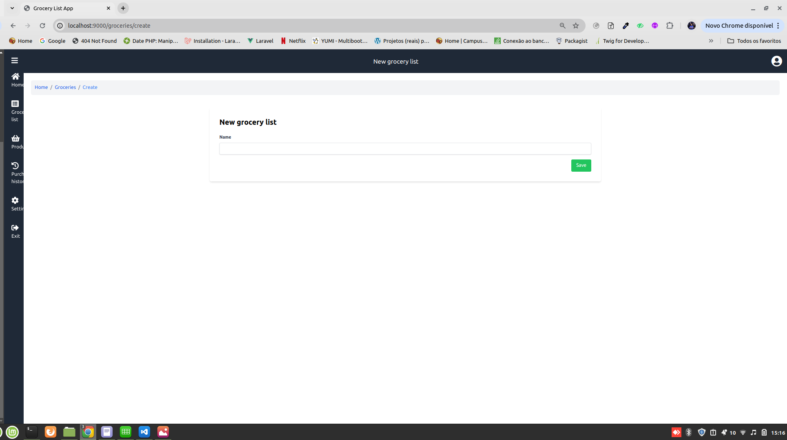
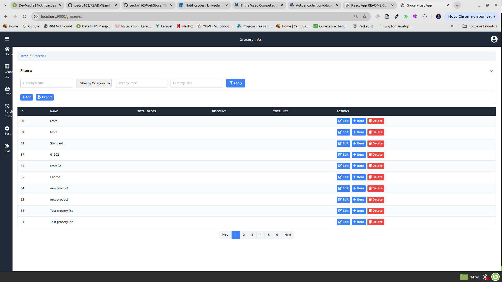
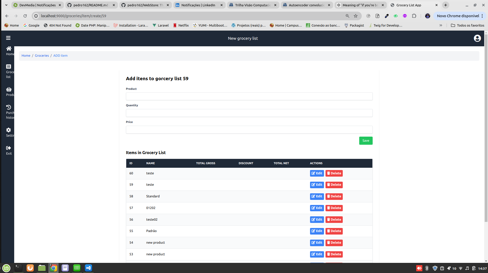
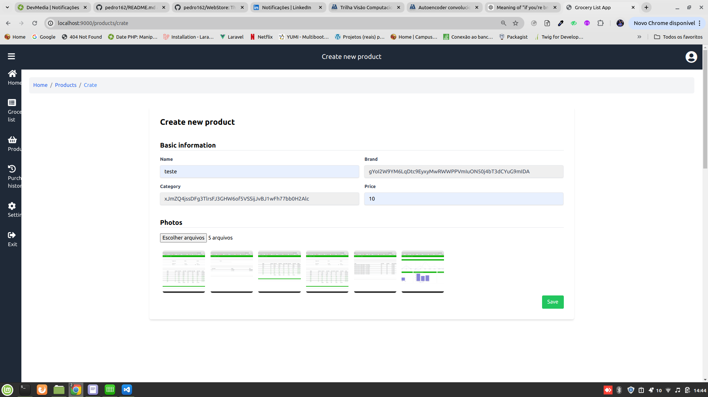
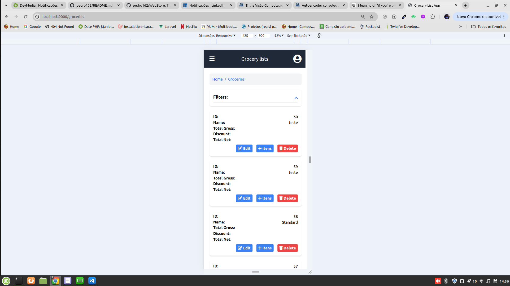
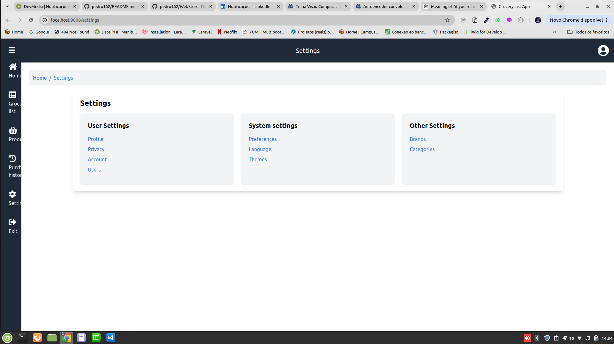

# Grocery List Application

This project is a Grocery List application where users can create new shopping lists, add items to the list, delete items, register products, and manage settings. The application is containerized using Docker Compose for easy setup and deployment. The frontend is built with Vue.js within a Laravel application using Vite.

## Table of Contents

-   [Introduction](#introduction)
-   [Prerequisites](#prerequisites)
-   [Installation](#installation)
-   [Configuration](#configuration)
-   [Running the Application](#running-the-application)
-   [Screenshots](#screenshots)
    -   [Create New Shopping List](#create-new-shopping-list)
    -   [Shopping List Report](#shopping-list-report)
    -   [Add Items to List](#add-items-to-list)
    -   [Delete Items](#delete-items)
    -   [Register Products](#register-products)
    -   [Settings](#settings)
-   [Video](#video)
-   [License](#license)

## Introduction

The Grocery List application helps users manage their shopping lists efficiently. Users can create new lists, add and delete items, register new products, and adjust settings as needed.

## Prerequisites

Before you begin, ensure you have Docker and Docker Compose installed on your machine.

-   [Docker](https://docs.docker.com/get-docker/)
-   [Docker Compose](https://docs.docker.com/compose/install/)

## Installation

Clone the repository:

```bash
git clone https://github.com/pedro162/grocery_list_app.git
cd grocery-list
```

## Configuration

No additional configuration is required. The default configuration is suitable for development and testing purposes.

## Running the Application

To run the application using Docker Compose, execute the following command in the project directory:

```bash
docker-compose up
```

This command will build and start the application containers. The application will be accessible at [http://localhost:9000](http://localhost:9000).

## Screenshots

### Create New Shopping List

The interface for creating a new shopping list allows users to add a title and start a new list.



### Shopping List Report

The shopping list report screen.



### Add Items to List

Users can add items to their shopping lists, specifying the product, quantity, and other details.



### Delete Items

Users can delete items from their shopping lists, keeping the list updated with current needs.

### Register Products

The product registration screen allows users to add new products to the database, making them available for use in shopping lists.




### Settings

The settings screen allows users to customize application preferences and manage their account details.



## Video

For a detailed walkthrough of the application features, watch the video below:


## License

This project is licensed under the MIT License
